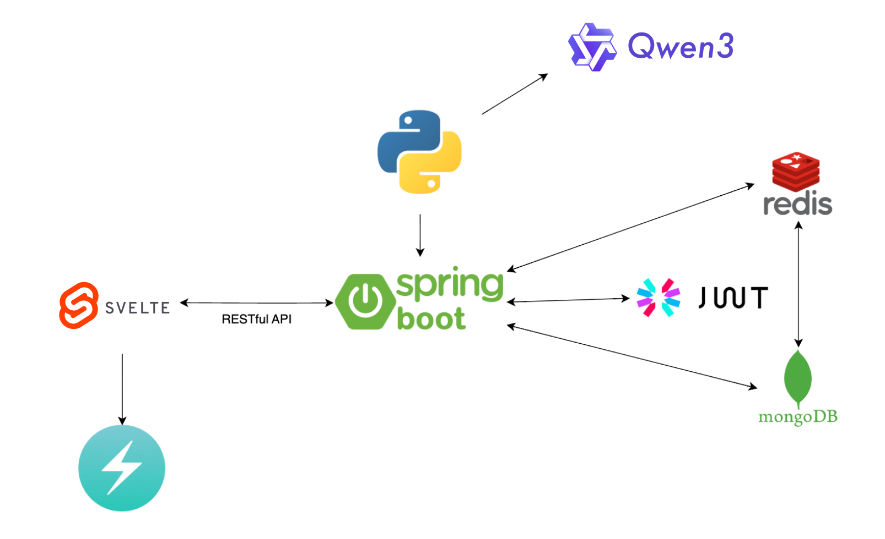

# 🍏 Fridget Frontend
**基于 Svelte 的 AI 智能食谱推荐网站前端**

## 🎯 项目灵感

本项目的灵感来源于 [Fridget_Frontend](https://github.com/sinaetown/Fridget_Frontend.git) 项目。在 YouTube 上观看了他们参加比赛的 Demo 视频后，被这个创意深深吸引，并仔细阅读了他们的代码实现。正巧最近在学习 Svelte 框架，因此决定用 SvelteKit 对这个优秀的项目进行前端重写，作为学习和实践的机会。

在此向原项目团队表示敬意，感谢他们提供了如此出色的创意和实现思路。
Special thanks to the original project team for providing such excellent ideas and implementation approaches.

- 🔗 [原后端仓库](https://github.com/sinaetown/Fridget_Backend.git)
- 🔗 [原项目前端](https://github.com/sinaetown/Fridget_Frontend.git)

## 📌 项目介绍

利用 [阿里通义千问AI](https://www.aliyun.com/product/tongyi) API，根据你冰箱里现有的食材找到美味的食谱！不再为"今天吃什么"而烦恼，让 AI 来为你搜索最合适的料理。

### 🚀 核心功能

1️⃣ **智能食谱搜索**：AI 在网络上搜索与你现有食材匹配的食谱

2️⃣ **个性化推荐**：使用最近邻算法分析你的饮食习惯和口味偏好

3️⃣ **偏好排序**：根据你的喜好对食谱进行降序排列，确保你优先看到最喜欢的选项

### 🔧 技术改进

在原项目基础上，我对后端接口进行了小幅度调整：
- 精简了 `/ingredients` 相关的 DTO 结构
- 新增了 `/cooking-preference` 接口
- 从 OpenAI 迁移到 阿里通义千问AI

> 这些调整主要考虑到中国用户的使用习惯和体验优化

## 🛠️ 技术栈

### 前端

### AI/ML

## 🏛️ 设计架构

